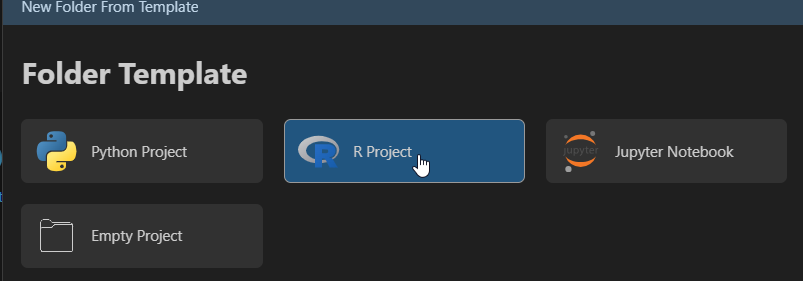
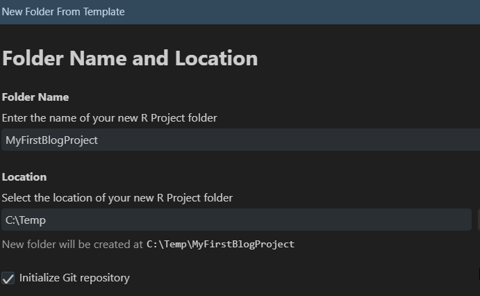
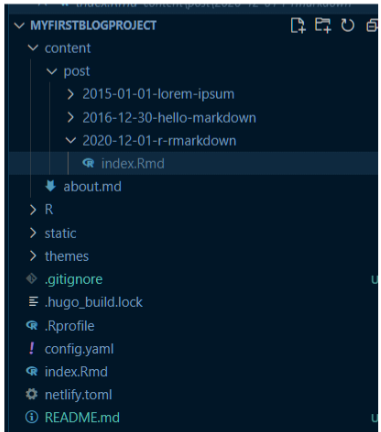
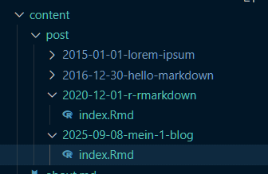
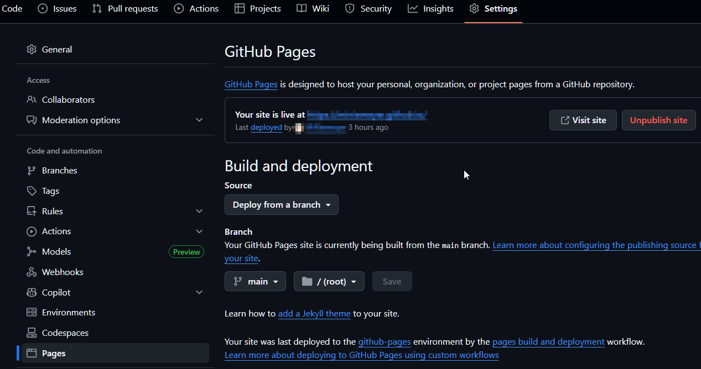
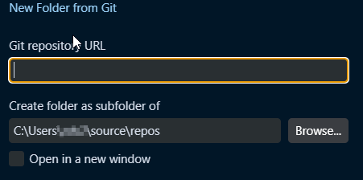

# MyFirstBlogDownProject

# Installation
## Positron installieren
Positron von https://positron.posit.co herunterladen und istallieren.
## R installieren 
 R von https://cran.r-project.org/ herunterladen und installieren.
## blogdown und Hugo installieren
   Positron öffnen und folgende Befehle im R-Konsolenfenster ausführen:
```r
    # blogdown Installation
    install.packages("blogdown")
    # Hugo Installation
    blogdown::install_Hugo
```
   
    
# Neues blogdown Projekt erstellen
## Neues Projekt anlegen





## .gitignore erweitern
`public/` in .gitignore einfügen, damit die zu veröffentlichende Webseite nicht ins Repo übernommen wird.
## blogdown Projekt initialisieren
In der R-Konsole `blogdown::new_site()` ausführen.

Hierdurch wird die eigentliche Strucktur erstellt und das Projekt sollte anschließend wie folgt aussehen:



# Neuen Post erstellen 
```r
    blogdown::new_post("Mein 1. Blog")     
```
Hierdurch wird eine neuer content/Eintrag erstellt. 



----

# Veröffentlichung auf .github.io
## Neues Repo auf Github erstellen
Wichtig: Der Name des Repo muss DEIN_BENUTZERNAME.github.io lauten. 

## Webseite neu erstellen
Wenn die Webseite noch nie veröffentlicht wurde und der Unterordner public noch nicht existiert.

In der R-Console ``` blogdown::build_site()``` ausführen.  
Hiermit wird der zu veröffentliche Unterordner public erstellt.

Im Terminal folgende Befehle ausführen, damit ein Git Repo in .\public erstellt, und nach .github.io veröffentlicht wird:

```bash
    cd .\public\
    git init
    git add .
    git commit -m "Website built with Hugo" 
    git remote add origin https://github.com/DEIN_BENUTZERNAME/DEIN_BENUTZERNAME.github.io 
    git branch -M main 
    git push -u origin main 
```
Hiernach sollte die Webseite auf .github.io unter Settings/Pages vorhanden sein.



Es kann jedoch einen Augenblick dauern bis hier alles aktualisiert wurde und die Seite mit [Visit site] aufgerufen werden kann.

## Webseite aktualisieren <a name="Update"></a>
Wurde die Webseite wie oben beschrieben bereits einmal erstellt, so sind folgende Schritte erforderlich um Änderungen an der Webseite zu veröffentlichen.

In der R-Console folgende Befehle ausführen, damit der public Ordner aktualisiert wird:
```r
    #Bereinigung von public
    blogdown::hugo_cmd("--cleanDestinationDir") 
    #public neu erstellen
    blogdown::build_site()
```
Im Terminal public in github.io mit folgenden Befehlen aktualisieren:
```bash
    cd .\public\
    git status
    git add .
    git commit -m "Update Website" 
    git push -u origin main 
```
Sollte beim push ein Fehler auftreten, dann vor dem push `git branch -M main` ausführen.

----

# Clone from Github
Wenn diese Projekt von Github geklont werden soll sind folgende Schritte notwendig, damit die Webseite lokal geändert und die Aktualisierung nach .github.io veröffentlicht werden kann.

## Projekt von Github initialisieren
Projekt von Github klonen:



In der R-Console `blogdown::build_site()` ausführen, damit Unterordner public erstellt wird. Dieser ist aufgrund von .gitignore nicht im Repo enthalten.

Im Terminal die aktuellste Version von public holen:
```bash
    cd .\public\
    Git init 
    Git remote add origin https://github.com/DEIN_BENUTZERNAME/DEIN_BENUTZERNAME.github.io 
    git fetch origin 
    # lokalen public/-Ordner auf den Remote-Stand setzen 
    git reset --hard origin/main  
    # Nun sollten keine Unterschiede vorhanden sein 
    Git status 
```

## Änderung an der Webseite vornehmen
+ Gewünschten Änderungen vornehmen 
+ [Update veröffentlichen ](#Update)


----

# R-Markdown als Standard
R-Markdown wurde nicht als Standard hinterlegt, da es wie unter [Markdown vs R-Markdown](https://miniemeyer.github.io/2025/09/08/positron-markdown-vs-r-markdown/) beschrieben Probleme mit der automatischen Aktualisierung der Vorschau bei R-Markdown gibt.

Wenn R-Markdown trotzdem als Standard hinterlegt werden soll müssen folgende Prameter in der Datei C:\Users\DEIN_BENUTZERNAME\Documents\.Rprofile hinzugefügt werden.
```bash
   options( 
      # Standard-Dateiendung 
      blogdown.ext = ".Rmd",          
      # Verhindern, dass Hugo eigene Dateien erstellt 
      blogdown.use_hugo_new_content = FALSE  
    )  
```
Hierdurch wird beim Erstellen von neuen Posts nicht mehr Index.md sondern Index.rmd erstellt. 

Zum Git-Ausschluss von index.md `content/post/**/*.md` in .gitignore einfügen. 